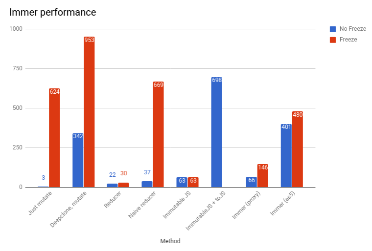

# Immer

[](https://www.npmjs.com/package/immer) [](http://img.badgesize.io/https://cdn.jsdelivr.net/npm/immer/dist/immer.umd.js) [](https://packagephobia.now.sh/result?p=immer) [](https://travis-ci.org/mweststrate/immer) [](https://coveralls.io/github/mweststrate/immer?branch=master) [](https://github.com/prettier/prettier) [](https://www.paypal.me/michelweststrate)

_Create the next immutable state tree by simply modifying the current tree_

### [Release notes](https://github.com/mweststrate/immer/releases)

Did Immer make a difference to your project? Consider buying me a coffee!<br/><a href="https://www.buymeacoffee.com/mweststrate" target="_blank"></a>

---

-   NPM: `npm install immer`
-   Yarn: `yarn add immer`
-   CDN: Exposed global is `immer`
    -   Unpkg: `<script src="https://unpkg.com/immer/dist/immer.umd.js"></script>`
    -   JSDelivr: `<script src="https://cdn.jsdelivr.net/npm/immer/dist/immer.umd.js"></script>`

---

-   Egghead lesson covering all of immer (7m): [Simplify creating immutable data trees with Immer](https://egghead.io/lessons/redux-simplify-creating-immutable-data-trees-with-immer)
-   Introduction blogpost: [Immer: Immutability the easy way](https://medium.com/@mweststrate/introducing-immer-immutability-the-easy-way-9d73d8f71cb3)

Immer (German for: always) is a tiny package that allows you to work with immutable state in a more convenient way. It is based on the [_copy-on-write_](https://en.wikipedia.org/wiki/Copy-on-write) mechanism.

The basic idea is that you will apply all your changes to a temporarily _draftState_, which is a proxy of the _currentState_. Once all your mutations are completed, Immer will produce the _nextState_ based on the mutations to the draft state. This means that you can interact with your data by simply modifying it while keeping all the benefits of immutable data.


Using Immer is like having a personal assistant; he takes a letter (the current state) and gives you a copy (draft) to jot changes onto. Once you are done, the assistant will take your draft and produce the real immutable, final letter for you (the next state).

A mindful reader might notice that this is quite similar to `withMutations` of ImmutableJS. It is indeed, but generalized and applied to plain, native JavaScript data structures (arrays and objects) without further needing any library.

## External resources

-   Blog: [The Rise of Immer in React](https://www.netlify.com/blog/2018/09/12/the-rise-of-immer-in-react/)
-   Blog: by Workday Prism on why they picked Immer to manage immutable state [The Search for a Strongly-Typed, Immutable State](https://medium.com/workday-engineering/workday-prism-analytics-the-search-for-a-strongly-typed-immutable-state-a09f6768b2b5)
-   Blog: [Immutability in React and Redux: The Complete Guide](https://daveceddia.com/react-redux-immutability-guide/)
-   Video tutorial: [Using Immer with React.setState](https://codedaily.io/screencasts/86/Immutable-Data-with-Immer-and-React-setState)
-   [Talk](https://www.youtube.com/watch?v=-gJbS7YjcSo) + [slides](http://immer.surge.sh/) on Immer at React Finland 2018 by Michel Weststrate

## API

The Immer package exposes a default function that does all the work.

`produce(currentState, producer: (draftState) => void): nextState`

There is also a curried overload that is explained [below](#currying).

## Example

```javascript
import produce from "immer"

const baseState = [
    {
        todo: "Learn typescript",
        done: true
    },
    {
        todo: "Try immer",
        done: false
    }
]

const nextState = produce(baseState, draftState => {
    draftState.push({todo: "Tweet about it"})
    draftState[1].done = true
})
```

The interesting thing about Immer is that the `baseState` will be untouched, but the `nextState` will reflect all changes made to `draftState`.

```javascript
// the new item is only added to the next state,
// base state is unmodified
expect(baseState.length).toBe(2)
expect(nextState.length).toBe(3)

// same for the changed 'done' prop
expect(baseState[1].done).toBe(false)
expect(nextState[1].done).toBe(true)

// unchanged data is structurally shared
expect(nextState[0]).toBe(baseState[0])
// changed data not (dûh)
expect(nextState[1]).not.toBe(baseState[1])
```

## Benefits

-   Immutability with normal JavaScript objects and arrays. No new APIs to learn!
-   Strongly typed, no string based paths selectors etc.
-   Structural sharing out of the box
-   Object freezing out of the box
-   Deep updates are a breeze
-   Boilerplate reduction. Less noise, more concise code.
-   Small: bundled and minified: 2KB.

Read further to see all these benefits explained.

## Reducer Example

Here is a simple example of the difference that Immer could make in practice.

```javascript
// Redux reducer
// Shortened, based on: https://github.com/reactjs/redux/blob/master/examples/shopping-cart/src/reducers/products.js
const byId = (state, action) => {
    switch (action.type) {
        case RECEIVE_PRODUCTS:
            return {
                ...state,
                ...action.products.reduce((obj, product) => {
                    obj[product.id] = product
                    return obj
                }, {})
            }
        default:
            return state
    }
}
```

After using Immer, that simply becomes:

```javascript
import produce from "immer"

const byId = (state, action) =>
    produce(state, draft => {
        switch (action.type) {
            case RECEIVE_PRODUCTS:
                action.products.forEach(product => {
                    draft[product.id] = product
                })
        }
    })
```

Notice that it is not needed to handle the default case, a producer that doesn't do anything will simply return the original state.

Creating Redux reducer is just a sample application of the Immer package. Immer is not just designed to simplify Redux reducers. It can be used in any context where you have an immutable data tree that you want to clone and modify (with structural sharing).

_Note: it might be tempting after using producers for a while, to just place `produce` in your root reducer and then pass the draft to each reducer and work directly over such draft. Don't do that. It kills the point of Redux where each reducer is testable as pure reducer. Immer is best used when applying it to small individual pieces of logic._

## React.setState example

Deep updates in the state of React components can be greatly simplified as well by using immer. Take for example the following onClick handlers (Try in [codesandbox](https://codesandbox.io/s/m4yp57632j)):

```javascript
/**
 * Classic React.setState with a deep merge
 */
onBirthDayClick1 = () => {
    this.setState(prevState => ({
        user: {
            ...prevState.user,
            age: prevState.user.age + 1
        }
    }))
}

/**
 * ...But, since setState accepts functions,
 * we can just create a curried producer and further simplify!
 */
onBirthDayClick2 = () => {
    this.setState(
        produce(draft => {
            draft.user.age += 1
        })
    )
}
```

## Currying

Passing a function as the first argument to `produce` is intended to be used for currying. This means that you get a pre-bound producer that only needs a state to produce the value from. The producer function gets passed in the draft and any further arguments that were passed to the curried function.

For example:

```javascript
// mapper will be of signature (state, index) => state
const mapper = produce((draft, index) => {
    draft.index = index
})

// example usage
console.dir([{}, {}, {}].map(mapper))
//[{index: 0}, {index: 1}, {index: 2}])
```

This mechanism can also nicely be leveraged to further simplify our example reducer:

```javascript
import produce from 'immer'

const byId = produce((draft, action) => {
  switch (action.type) {
    case RECEIVE_PRODUCTS:
      action.products.forEach(product => {
        draft[product.id] = product
      })
      return
    })
  }
})
```

Note that `state` is now factored out (the created reducer will accept a state, and invoke the bound producer with it).

If you want to initialize an uninitialized state using this construction, you can do so by passing the initial state as second argument to `produce`:

```javascript
import produce from "immer"

const byId = produce(
    (draft, action) => {
        switch (action.type) {
            case RECEIVE_PRODUCTS:
                action.products.forEach(product => {
                    draft[product.id] = product
                })
                return
        }
    },
    {
        1: {id: 1, name: "product-1"}
    }
)
```

##### Fun with currying

A random fun example just for inspiration: a neat trick is to turn `Object.assign` into a producer to create a "spread" function that is smarter than the normal spread operator, as it doesn't produce a new state if the result doesn't actually change ([details & explanation](https://twitter.com/mweststrate/status/1045059430256119809)). Quick example:

```javascript
import produce from "immer"
const spread = produce(Object.assign)

const base = {x: 1, y: 1}

console.log({...base, y: 1} === base) // false
console.log(spread(base, {y: 1}) === base) // true! base is recycled as no actual new value was produced
console.log(spread(base, {y: 2}) === base) // false, produced a new object as it should
```

## Patches

During the run of a producer, Immer can record all the patches that would replay the changes made by the reducer. This is a very powerful tool if you want to fork your state temporarily and replay the changes to the original.

Patches are useful in few scenarios:

-   To exchange incremental updates with other parties, for example over websockets
-   For debugging / traces, to see precisely how state is changed over time
-   As basis for undo/redo or as an approach to replay changes on a slightly different state tree

To help with replaying patches, `applyPatches` comes in handy. Here is an example how patches could be used to record the incremental updates and (inverse) apply them:

```javascript
import produce, {applyPatches} from "immer"

let state = {
    name: "Micheal",
    age: 32
}

// Let's assume the user is in a wizard, and we don't know whether
// his changes should end up in the base state ultimately or not...
let fork = state
// all the changes the user made in the wizard
let changes = []
// the inverse of all the changes made in the wizard
let inverseChanges = []

fork = produce(
    fork,
    draft => {
        draft.age = 33
    },
    // The third argument to produce is a callback to which the patches will be fed
    (patches, inversePatches) => {
        changes.push(...patches)
        inverseChanges.push(...inversePatches)
    }
)

// In the meantime, our original state is replaced, as, for example,
// some changes were received from the server
state = produce(state, draft => {
    draft.name = "Michel"
})

// When the wizard finishes (successfully) we can replay the changes that were in the fork onto the *new* state!
state = applyPatches(state, changes)

// state now contains the changes from both code paths!
expect(state).toEqual({
    name: "Michel", // changed by the server
    age: 33 // changed by the wizard
})

// Finally, even after finishing the wizard, the user might change his mind and undo his changes...
state = applyPatches(state, inverseChanges)
expect(state).toEqual({
    name: "Michel", // Not reverted
    age: 32 // Reverted
})
```

The generated patches are similar (but not the same) to the [RFC-6902 JSON patch standard](http://tools.ietf.org/html/rfc6902), except that the `path` property is an array, rather than a string. This makes processing patches easier. If you want to normalize to the official specification, `patch.path = patch.path.join("/")` should do the trick. Anyway, this is what a bunch of patches and their inverse could look like:

```json
[
    {
        "op": "replace",
        "path": ["profile"],
        "value": {"name": "Veria", "age": 5}
    },
    {"op": "remove", "path": ["tags", 3]}
]
```

```json
[
    {"op": "replace", "path": ["profile"], "value": {"name": "Noa", "age": 6}},
    {"op": "add", "path": ["tags", 3], "value": "kiddo"}
]
```

For a more in-depth study, see [Distributing patches and rebasing actions using Immer](https://medium.com/@mweststrate/distributing-state-changes-using-snapshots-patches-and-actions-part-2-2f50d8363988)

Tip: Check this trick to [compress patches](https://medium.com/@david.b.edelstein/using-immer-to-compress-immer-patches-f382835b6c69) produced over time.

## Auto freezing

Immer automatically freezes any state trees that are modified using `produce`. This protects against accidental modifications of the state tree outside of a producer. This comes with a performance impact, so it is recommended to disable this option in production. It is by default enabled. By default, it is turned on during local development and turned off in production. Use `setAutoFreeze(true / false)` to explicitly turn this feature on or off.

## Returning data from producers

It is not needed to return anything from a producer, as Immer will return the (finalized) version of the `draft` anyway. However, it is allowed to just `return draft`.

It is also allowed to return arbitrarily other data from the producer function. But _only_ if you didn't modify the draft. This can be useful to produce an entirely new state. Some examples:

```javascript
const userReducer = produce((draft, action) => {
    switch (action.type) {
        case "renameUser":
            // OK: we modify the current state
            draft.users[action.payload.id].name = action.payload.name
            return draft // same as just 'return'
        case "loadUsers":
            // OK: we return an entirely new state
            return action.payload
        case "adduser-1":
            // NOT OK: This doesn't do change the draft nor return a new state!
            // It doesn't modify the draft (it just redeclares it)
            // In fact, this just doesn't do anything at all
            draft = {users: [...draft.users, action.payload]}
            return
        case "adduser-2":
            // NOT OK: modifying draft *and* returning a new state
            draft.userCount += 1
            return {users: [...draft.users, action.payload]}
        case "adduser-3":
            // OK: returning a new state. But, unnecessary complex and expensive
            return {
                userCount: draft.userCount + 1,
                users: [...draft.users, action.payload]
            }
        case "adduser-4":
            // OK: the immer way
            draft.userCount += 1
            draft.users.push(action.payload)
            return
    }
})
```

_Note: It is not possible to return `undefined` this way, as it is indistinguishable from *not* updating the draft! Read on..._

## Producing `undefined` using `nothing`

So, in general, one can replace the current state by just `return`ing a new value from the producer, rather than modifying the draft. There is a subtle edge case however: if you try to write a producer that wants to replace the current state with `undefined`:

```javascript
produce({}, draft => {
    // don't do anything
})
```

Versus:

```javascript
produce({}, draft => {
    // Try to return undefined from the producer
    return undefined
})
```

The problem is that in JavaScript a function that doesn't return anything also returns `undefined`! So immer cannot differentiate between those different cases. So, by default, Immer will assume that any producer that returns `undefined` just tried to modify the draft.

However, to make it clear to Immer that you intentionally want to produce the value `undefined`, you can return the built-in token `nothing`:

```javascript
import produce, {nothing} from "immer"

const state = {
    hello: "world"
}

produce(state, draft => {})
produce(state, draft => undefined)
// Both return the original state: { hello: "world"}

produce(state, draft => nothing)
// Produces a new state, 'undefined'
```

N.B. Note that this problem is specific for the `undefined` value, any other value, including `null`, doesn't suffer from this issue.

## Extracting the original object from a proxied instance

Immer exposes a named export `original` that will get the original object from the proxied instance inside `produce` (or return `undefined` for unproxied values). A good example of when this can be useful is when searching for nodes in a tree-like state using strict equality.

```js
const baseState = {users: [{name: "Richie"}]}
const nextState = produce(baseState, draftState => {
    original(draftState.users) // is === baseState.users
})
```

Just want to know if a value is a proxied instance? Use the `isDraft` function!

```js
import {isDraft} from "immer"

const baseState = {users: [{name: "Bobby"}]}
const nextState = produce(baseState, draft => {
    isDraft(draft) // => true
    isDraft(draft.users) // => true
    isDraft(draft.users[0]) // => true
})
isDraft(nextState) // => false
```

## Using `this`

The recipe will be always invoked with the `draft` as `this` context.

This means that the following constructions are also valid:

```javascript
const base = {counter: 0}

const next = produce(base, function() {
    this.counter++
})
console.log(next.counter) // 1

// OR
const increment = produce(function() {
    this.counter++
})
console.log(increment(base).counter) // 1
```

## Inline shortcuts using `void`

Draft mutations in Immer usually warrant a code block, since a return denotes an overwrite. Sometimes that can stretch code a little more than you might be comfortable with.

In such cases, you can use javascripts [`void`](https://developer.mozilla.org/en-US/docs/Web/JavaScript/Reference/Operators/void) operator, which evaluates expressions and returns `undefined`.

```javascript
// Single mutation
produce(draft => void (draft.user.age += 1))

// Multiple mutations
produce(draft => void ((draft.user.age += 1), (draft.user.height = 186)))
```

Code style is highly personal, but for code bases that are to be understood by many, we recommend to stick to the classic `draft => { draft.user.age += 1}` to avoid cognitive overhead.

## TypeScript or Flow

The Immer package ships with type definitions inside the package, which should be picked up by TypeScript and Flow out of the box and without further configuration.

The TypeScript typings automatically remove `readonly` modifiers from your draft types and return a value that matches your original type. See this practical example:

```ts
import produce from "immer"

interface State {
    readonly x: number
}

// `x` cannot be modified here
const state: State = {
    x: 0
}

const newState = produce<State>(state, draft => {
    // `x` can be modified here
    draft.x++
})

// `newState.x` cannot be modified here
```

This ensures that the only place you can modify your state is in your produce callbacks. It even works recursively and with `ReadonlyArray`s!

**Note:** Immer v1.9+ supports Typescript v3.1+ only.

## Immer on older JavaScript environments?

By default `produce` tries to use proxies for optimal performance. However, on older JavaScript engines `Proxy` is not available. For example, when running Microsoft Internet Explorer or React Native on Android. In such cases, Immer will fallback to an ES5 compatible implementation which works identical, but is a bit slower.

## Importing immer

`produce` is exposed as the default export, but optionally it can be used as name import as well, as this benefits some older project setups. So the following imports are all correct, where the first is recommended:

```javascript
import produce from "immer"
import {produce} from "immer"

const {produce} = require("immer")
const produce = require("immer").produce
const produce = require("immer").default

import unleashTheMagic from "immer"
import {produce as unleashTheMagic} from "immer"
```

## Limitations

Immer supports the following types of data:

1. All kinds of primitive values
1. `Date` instances, but: only if not mutated, see below
1. Arrays, but: non-standard attributes are not supported (like: `array.test = "Test"`)
1. Plain objects (objects that have as prototype either `null` or `Object`)
1. Functions, assuming they aren't mutated
1. Other value types (like class instances) can be stored in the tree, but note that Immer won't work _inside_ those objects. In other words, if you modify a class instance, this will _not_ result in clone and unmodified original, but just in a modified original.

# Pitfalls

1. Don't redefine draft like, `draft = myCoolNewState`. Instead, either modify the `draft` or return a new state. See [Returning data from producers](#returning-data-from-producers).
1. Immer assumes your state to be a unidirectional tree. That is, no object should appear twice in the tree, and there should be no circular references.
1. Class instances are not, and will not have first-class support. Read [here](https://github.com/mweststrate/immer/issues/155#issuecomment-407725592) why classes are a conceptual mismatch (and technically extremely challenging)
1. For example, working with `Date` objects is no problem, just make sure you never modify them (by using methods like `setYear` on an existing instance). Instead, always create fresh `Date` instances. Which is probably what you were unconsciously doing already.
1. Since Immer uses proxies, reading huge amounts of data from state comes with an overhead (especially in the ES5 implementation). If this ever becomes an issue (measure before you optimize!), do the current state analysis before entering the producer function or read from the `currentState` rather than the `draftState`. Also, realize that immer is opt-in everywhere, so it is perfectly fine to manually write super performance critical reducers, and use immer for all the normal ones. Also note that `original` can be used to get the original state of an object, which is cheaper to read.
1. Some debuggers (at least Node 6 is known) have trouble debugging when Proxies are in play. Node 8 is known to work correctly.
1. Always try to pull `produce` 'up', for example `for (let x of y) produce(base, d => d.push(x))` is exponentially slower than `produce(base, d => { for (let x of y) d.push(x)})`
1. It is possible to return values from producers, except, it is not possible to return `undefined` that way, as it is indistinguishable from not updating the draft at all! If you want to replace the draft with `undefined`, just return `nothing` from the producer.
1. Immer does not support built-in data-structures like `Map` and `Set`. However, it is fine to just immutably "update" them yourself but still leverage immer wherever possible:

```javascript
const state = {
    title: "hello",
    tokenSet: new Set()
}

const nextState = produce(state, draft => {
    draft.title = draft.title.toUpperCase() // let immer do it's job
    // don't use the operations onSet, as that mutates the instance!
    // draft.tokenSet.add("c1342")

    // instead: clone the set (once!)
    const newSet = new Set(draft.tokenSet)
    // mutate the clone (just in this producer)
    newSet.add("c1342")
    // update the draft with the new set
    draft.tokenSet = newSet
})
```

Or a deep update in maps (well, don't use maps for this use case, but as an example):

```javascript
const state = {
    users: new Map(["michel", {name: "miche"}])
}

const nextState = produce(state, draft => {
    const newUsers = new Map(draft.users)
    // mutate the new map and set a _new_ user object
    // but leverage produce again to base the new user object on the original one
    newUsers.set(
        "michel",
        produce(draft.users.get("michel"), draft => {
            draft.name = "michel"
        })
    )
    draft.users = newUsers
})
```

## Cool things built with immer

-   [react-copy-write](https://github.com/aweary/react-copy-write) _Immutable state with a mutable API_
-   [redux-starter-kit](https://github.com/markerikson/redux-starter-kit) _A simple set of tools to make using Redux easier_
-   [immer based handleActions](https://gist.github.com/kitze/fb65f527803a93fb2803ce79a792fff8) _Boilerplate free actions for Redux_
-   [redux-box](https://github.com/anish000kumar/redux-box) _Modular and easy-to-grasp redux based state management, with least boilerplate_
-   [quick-redux](https://github.com/jeffreyyoung/quick-redux) _tools to make redux development quicker and easier_
-   [bey](https://github.com/jamiebuilds/bey) _Simple immutable state for React using Immer_
-   [immer-wieder](https://github.com/drcmda/immer-wieder#readme) _State management lib that combines React 16 Context and immer for Redux semantics_
-   [robodux](https://github.com/neurosnap/robodux) _flexible way to reduce redux boilerplate_
-   [immer-reducer](https://github.com/epeli/immer-reducer) _Type-safe and terse Redux reducers with Typescript_
-   ... and [many more](https://www.npmjs.com/browse/depended/immer)

## How does Immer work?

Read the (second part of the) [introduction blog](https://medium.com/@mweststrate/introducing-immer-immutability-the-easy-way-9d73d8f71cb3).

## Example patterns.

_For those who have to go back to thinking in object updates :-)_

```javascript
import produce from "immer"

// object mutations
const todosObj = {
    id1: {done: false, body: "Take out the trash"},
    id2: {done: false, body: "Check Email"}
}

// add
const addedTodosObj = produce(todosObj, draft => {
    draft["id3"] = {done: false, body: "Buy bananas"}
})

// delete
const deletedTodosObj = produce(todosObj, draft => {
    delete draft["id1"]
})

// update
const updatedTodosObj = produce(todosObj, draft => {
    draft["id1"].done = true
})

// array mutations
const todosArray = [
    {id: "id1", done: false, body: "Take out the trash"},
    {id: "id2", done: false, body: "Check Email"}
]

// add
const addedTodosArray = produce(todosArray, draft => {
    draft.push({id: "id3", done: false, body: "Buy bananas"})
})

// delete
const deletedTodosArray = produce(todosArray, draft => {
    draft.splice(draft.findIndex(todo => todo.id === "id1"), 1)
    // or (slower):
    // return draft.filter(todo => todo.id !== "id1")
})

// update
const updatedTodosArray = produce(todosArray, draft => {
    draft[draft.findIndex(todo => todo.id === "id1")].done = true
})
```

## Performance

Here is a [simple benchmark](__performance_tests__/todo.js) on the performance of Immer. This test takes 50,000 todo items and updates 5,000 of them. _Freeze_ indicates that the state tree has been frozen after producing it. This is a _development_ best practice, as it prevents developers from accidentally modifying the state tree.

These tests were executed on Node 9.3.0. Use `yarn test:perf` to reproduce them locally.



Most important observation:

-   Immer with proxies is roughly speaking twice to three times slower as a handwritten reducer (the above test case is worst case, see `yarn test:perf` for more tests). This is in practice negligible.
-   Immer is roughly as fast as ImmutableJS. However, the _immutableJS + toJS_ makes clear the cost that often needs to be paid later; converting the immutableJS objects back to plain objects, to be able to pass them to components, over the network etc... (And there is also the upfront cost of converting data received from e.g. the server to immutable JS)
-   Generating patches doesn't significantly slow immer down
-   The ES5 fallback implementation is roughly twice as slow as the proxy implementation, in some cases worse.

## FAQ

_(for those who skimmed the above instead of actually reading)_

**Q: Does Immer use structural sharing? So that my selectors can be memoized and such?**

A: Yes

**Q: Does Immer support deep updates?**

A: Yes

**Q: I can't rely on Proxies being present on my target environments. Can I use Immer?**

A: Yes

**Q: Can I typecheck my data structures when using Immer?**

A: Yes

**Q: Can I store `Date` objects, functions etc in my state tree when using Immer?**

A: Yes

**Q: Is it fast?**

A: Yes

**Q: Idea! Can Immer freeze the state for me?**

A: Yes

## Credits

Special thanks to @Mendix, which supports its employees to experiment completely freely two full days a month, which formed the kick-start for this project.

## Donations

A significant part of my OSS work is unpaid. So [donations](https://mobx.js.org/donate.html) are greatly appreciated :)
